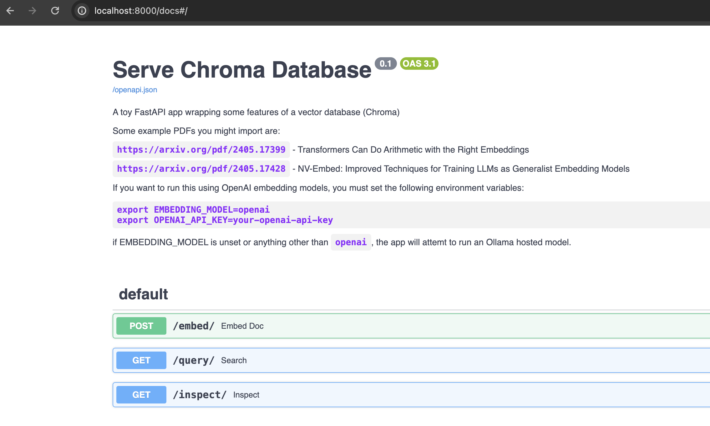

# Ragtime - A RAG pipeline exercise

A toy RAG pipeline.
I'm using this project to familiarize myself with LangChain.

I'm using Chroma as the document store and Ollama to run the LLM locally.
I currently only have the Vector DB implemented, but it seems like
this would be fairly easy to turn into a RAG pipeline with LangChain.

## Running the app

You must have Ollama and poetry installed on your machine,
and an appropriate python version.

If you have all the pre-requisites you can start the server with:

```shell
poetry install # Only do this once
poetry run start-server
```


## Overview



I have implemented a toy FastAPI app that exposes a few routes you can use to interact
with a vector database. Visit `localhost:8000/docs` for details. Here is an overview:

- `/embed` Pass the URI of a PDF on arxiv.org and the app will ingest it into the DB.
- `/query` Pass a string used to query the vector DB.
The closest matching document section is returned, along with the relevance score.
- `/inspect` Returns the contents of the vectorDB. Limited to 10 results.

I leaned on [langchain](https://www.langchain.com/) heavily for this exercise.
Most of my time was spent reading docs and understanding the interfaces of all of
the langchain tools. I'd say I spent a solid 6 hours on this in total.
About half of that time was spent making this guide...
I've been meaning to learn more about the LangChain stack though, so this was time well spent
for me.

### Corners Cut

The fastAPI app instantiates a ChromaDB in memory in the uvicorn process serving the app.
Each process gets a fresh Chroma database, and they have nothing to do with each other.
In production you'd want to use a client to connect to a single datastore of course.

I punted on cleaning/pre-processing the documents.
I found some good ideas by googling around, like inserting heading data into the raw text
(by inspecting text size), but I didn't implement anything.

I also had to normalize the vectors returned by Ollama's embedding model.
This involves a lot of gross casting to/from np.array objects.
In a production system, I'd probably not use Ollama in the first place.


## Source Docs

I used the [CS papers](https://arxiv.org/list/cs/recent) from arxiv.org as suggested.

## Reading the documents

You can load any paper into the ragtime vector DB by passing the URL pointing to it.
For example: 

```shell
curl -X 'POST' \
  'http://localhost:8000/embed/?document_uri=https%3A%2F%2Farxiv.org%2Fpdf%2F2405.17399' \
  -H 'accept: application/json' \
  -d ''
```

Will ingest the desired document asynchronously.
This route uses the
[PyPDFLoader](https://api.python.langchain.com/en/latest/document_loaders/langchain_community.document_loaders.pdf.PyPDFLoader.html) from langchain.
There are many options available to parse PDFs. Each seem to have strengths and weaknesses.
I did not spend much time exploring options in this space. PyPDFLoader was the first one I tried
and it seemed to work reasonably well. I noticed that tables were imported as raw text,
which is probably not acceptable in a realistic environment.
In real life I would not feel comfortable using this library without more investigation.

## Chunking

I used [RecursiveCharacterTextSplitter](https://api.python.langchain.com/en/latest/character/langchain_text_splitters.character.RecursiveCharacterTextSplitter.html)
from langchain to chunk the PDF text into LLM manageable peices.
The Library allows splitting on whitespace, as well as defining fixed chunk sizes.
I chose the default chunk size of 1000 characters, with a 200 character overlap.
These settings seem reasonable to me, but I suspect the choices here could heavily impact
the quality of documents retrieved and subsequent LLM output.


## Preprocessing

I punted on this.
I found some good ideas by googling around, like inserting heading data into the raw text
(by inspecting text size), but I didn't implement anything.


## Embeddings

I tried using a few models provided by [Ollama](https://ollama.com/)
to run the embeddings locally. I also used the OpenAI embedding models available.
The `mxbai-embed-large` embedding model was small enough to run reasonably well
on my laptop (8 CPU, no GPU), but (anecdotally) the results seemed to not be as
good as those I got when using OpenAI to provide the embeddings for the
docs and queries.
The Ollama embedding models didn't produce normalized vectors, so I had to
to a little hacking to get them to produce normalized vectors and also fit into
the interface LangChain was expecting.

## Search

Searching was easy, as ChromaDB provides a nice interface for this.
The Chroma client vectorizes your query with the same model used to
vecrotize the docs, and lets you choose how many docs to return.
